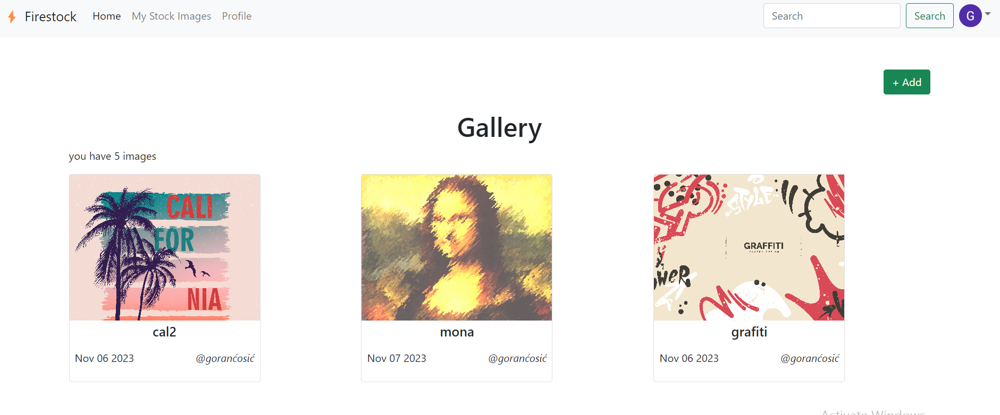

## Responsive Single Page Application - GALLERY APP

## Project Overview 🎉

Based on a Video Course made by Sandy Ludosky I created a:
"Gallery App" where I used ReactJS and Firebase to create a modern Single Page Application.

## Technologies 🔧

- HTML
- CSS
- Javascript
- ReactJS - Context API, client-side routing with React-Router V6
- Firebase - Firestore Database, Storage, Authentication, Hosting

## Screenshots 📺

    

## Live 📍

https://gallery-app-ed9f3.web.app/

## License 🔱

Open source license.
